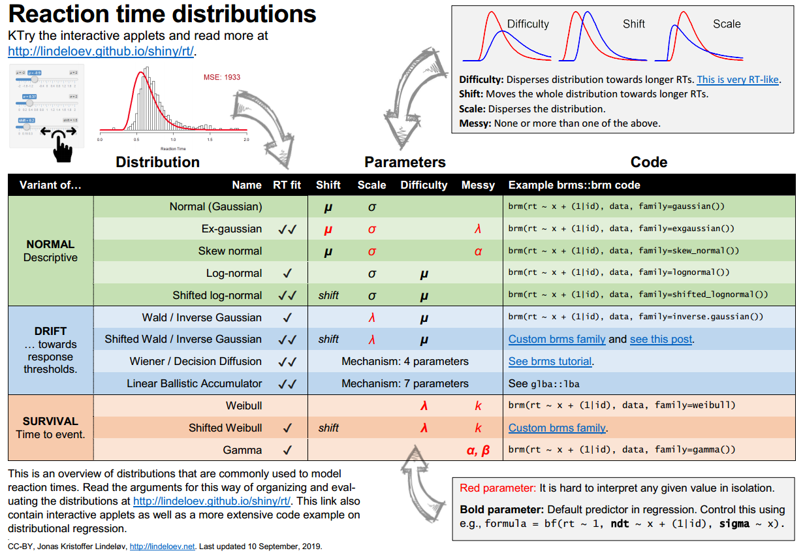
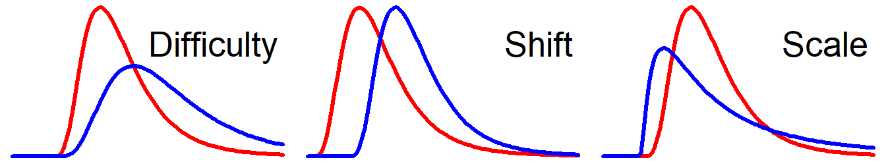

<!-- 
For everyone looking here: setting up my own shiny server caused major
issues with:
 
 * Hash links (anchors) do not work.
 * The content does not float below the TOC on narrow screens (mobile).
 * Files cannot be served via shiny, so I have to link to the GitHub folder.
 * No HTTPS certificate, so could not host index.html at lindeloev.github.io.
 
These issue do not apply to shinyapps.io or when running locally.


TO DO for later and probably never...
   *  add brms families for shifted Weibull and shifted Wald
   * (Minor) The dataset selector does not update the trims and bin values when these are set in update_data
   * Server problem: Make the links work inside the iframe and the menu should float top.
-->


```{r, context="setup", echo=FALSE, message=FALSE, warning=FALSE}
# # Uncomment if you haven't got these packages yet:
# install.packages('brms')
# install.packages('RWiener')  # For dwiener
# install.packages('shiny')
# install.packages('rtdists')

# Import stuff
library(shiny)
library(rtdists)  # For dLBA

# I had problems installing brms on Google Cloud, so I did a manual replacement:
#library(brms)
source('brms_simulator/misc.R'); source('brms_simulator/distributions.R')


# SETTINGS
FIG_HEIGHT = 290
TRIM_MIN = 0.180
TRIM_MAX = 2
BINS = 70
RESOLUTION = 1024  # Number of points to evaluate densities at
NSAMPLES = 10000  # Number of samples for theoretical distributions
UPDATE_INTERVAL = 1000  # ms between each applet checking for updates in dataset

# Score as scaled mean squared difference between empirical and theoretical density
# This score is a bit arbitrary, but it should be good enough
score_fit = function(rt_type, dfun) {
  #rts = rt_data  # Get the relevant data
  empirical_density = density(rt_data, from=0, to=TRIM_MAX, n = 1024, bw=0.02)$y  # From actual observations
  theoretical_density = dfun(seq(1/RESOLUTION, TRIM_MAX, length.out = 1024))  # From density function. Start at 1 so invgauss doesn't fail
  round(mean((theoretical_density - empirical_density)^2) * 10000)  # Mean squares. Scaled and rounded to digestible number
}


# Show a plot, theoretical density, and score
show_plot = function(input, dfun = NULL) {
  # Histogram
  par(mar = c(5, 0, 0, 0) + 0.1)
  hist(rt_data, breaks=seq(0, TRIM_MAX, TRIM_MAX/BINS), xlim=c(0, TRIM_MAX), 
       freq = FALSE, 
       axes = FALSE,  # To remove y-axis, we need to remove both first...
       xlab = 'Reaction Time', ylab = NULL, main = NULL)
  axis(1)  # Add x-axis
  
  if(!is.null(dfun)) {
    # Add theoretical curve
    curve(dfun, add=TRUE, lwd=4, col='red')
    
    # Present score as legend
    error = score_fit(input$rt_type, dfun)
    legend(
      'topright',
      inset = 0.05,
      # = 1,
      #y = 2,
      cex = 2,
      box.col = NA,
      bg = NA,

      # Set text and text color based on error
      text.col = ifelse(error < 40, '#AA9944', ifelse(
        error < 150, '#00BB00', ifelse(error > 300, '#BB0000', 'black')
      )),
      legend = paste0('MSE: ', error, ifelse(error < 40, '\nNailed it!', ''))
    )
  }
}
```


<!-- Generate datasets -->
```{r, context="setup", echo=FALSE}
data("rr98")
data("speed_acc")
mrt_data = read.csv('mrt_data.csv')

rt_types = c(
  # Real RTs
  'Brightness discrimination (Ratcliff & Rouder, 1998)' = 'rr98',
  'Discriminate words/non-words - be accurate (Wagenmakers et al., (2008)' = 'accuracy',
  'Discriminate words/non-words - be fast (Wagenmakers et al., (2008)' = 'speed',
  'Mental Rotation of 2D figures - 0-30 degrees' = 'mrt_short',
  'Mental Rotation of 2D figures - 150-180 degrees' = 'mrt_long',
  
  # Theoretical RTs
  'Theoretical: Gaussian (Normal distribution)' = 'gauss',
  'Theoretical: Ex-gaussian' = 'exgauss',
  'Theoretical: Wiener diffusion' = 'wiener',
  'Theoretical: Inverse Gaussian (Wald)' = 'invgauss',
  'Theoretical: Shifted Log-normal' = 'slog',
  'Theoretical: Skew-normal' = 'skew',
  'Theoretical: Gamma' = 'gamma',
  'Theoretical: Weibull' = 'sweibull'
)

last_data_update = Sys.time()  # For init
update_data = function(rt_type) {
  last_data_update <<- Sys.time()
  # Typical use case: choose by label
  if(is.character(rt_type)) {
    set.seed(42)
    rt_data = switch(rt_type,
      # Real datasets
      'accuracy' = subset(speed_acc, condition == 'accuracy' & id == 3)$rt,
      'speed' = subset(speed_acc, condition == 'speed' & id == 3)$rt,
      'rr98' = subset(rr98, correct == TRUE & id == 'nh' & source == 'light')$rt,
      'mrt_short' = subset(mrt_data, rotation_cat == 'short')$rt,
      'mrt_long' = subset(mrt_data, rotation_cat == 'long')$rt,
      
      # Theoretical datasets
      'gauss' = rnorm(NSAMPLES, mean=0.7, sd=0.2),
      'exgauss' = rexgaussian(NSAMPLES, mu=0.7, sigma=0.1, beta=0.3),
      'wiener' = rwiener(NSAMPLES, alpha=1.5, tau=0.2, beta=0.6, delta=1)$q,
      'invgauss' = rshifted_inv_gaussian(NSAMPLES, mu=0.6, shape=3, shift=0),
      #'log' = rlnorm(NSAMPLES, meanlog=-0.6, sdlog=0.3),
      'slog' = rshifted_lnorm(NSAMPLES, meanlog=-1, sdlog=0.5, shift=0.2),
      'skew' = rskew_normal(NSAMPLES, mu=0.7, sigma=0.2, alpha=6),
      'gamma' = rgamma(NSAMPLES, shape=15, rate=15),
      #'weibull' = rweibull(NSAMPLES, shape=3.5, scale=0.6),
      'sweibull' = rshifted_weibull(NSAMPLES, shape=5, scale=0.8, shift=0)
    )
      
    if(rt_type == 'rr98') TRIM_MAX <<- 1.2
    if(rt_type %in% c('mrt_short', 'mrt_long')) {
      TRIM_MAX <<- 8
      BINS <<- 20
    }
    
  # But one can also insert one's own data:
  } else if(is.numeric(rt_type)) {
    rt_data = rt_type
  }
  
  # Make sure that it stays within bounds, and assign to global scope
  rt_data <<- rt_data[ifelse(rt_data < TRIM_MIN | rt_data > TRIM_MAX, FALSE, TRUE)]
}

```


<!-- CSS styles -->
<link rel="stylesheet" type="text/css" href="include/style.css">

<!-- VIsible meta-data -->
By Jonas Kristoffer Lindeløv ([blog](https://lindeloev.net), [profile](https://vbn.aau.dk/da/persons/117060)).<br />
Updated: `r format(Sys.time(), '%d %B, %Y')` ([source](https://github.com/lindeloev/shiny-rt/), [changes](https://github.com/lindeloev/shiny-rt/commits/master)).


<!-- Social sharing. From simplesharebuttons.com -->
<style type="text/css">
  #share-buttons img {
    width: 40px;
    padding-right: 15px; vertical-align: top;
    border: 0;
    box-shadow: 0;
    display: inline;
    vertical-align: top;
  }
</style>


<!-- For some reason, the code below ignores this style. 
So I've inserted styles manually. Ugly. -->
<div id="share-buttons">
  <!-- Twitter -->
  <script async src="https://platform.twitter.com/widgets.js" charset="utf-8"></script>
  <a href="https://twitter.com/intent/tweet?text=Reaction time distributions: an interactive overview https://lindeloev.net/shiny/rt/" class="twitter-hashtag-button" data-size="large" data-related="jonaslindeloev" data-show-count="false">Share on Twitter</a>
  &nbsp;&nbsp;&nbsp;
  <!-- Facebook -->
  <a href="http://www.facebook.com/sharer.php?u=https://lindeloev.net/shiny/rt/" target="_blank"></a>
  <!-- LinkedIn -->
  <a href="http://www.linkedin.com/shareArticle?mini=true&amp;url=https://lindeloev.net/shiny/rt/" target="_blank"></a>
  <!-- Digg -->
  <a href="http://www.digg.com/submit?url=https://lindeloev.net/shiny/rt/" target="_blank"></a>
  <!-- Reddit -->
  <a href="http://reddit.com/submit?url=https://lindeloev.net/shiny/rt/&amp;title=Reaction time distributions: an interactive overview" target="_blank"></a>
  <!-- Email -->
  <a href="mailto:?Subject=Reaction time distributions: an interactive overview&amp;Body=https://lindeloev.net/shiny/rt/"></a>
</div>


<br />


All too often, researchers use the normal distribution to model reaction times. Hopefully, this document to lower the burden of shifting to better distributions. Because the normal distribution is so poor for RTs (as you will see), the reward of shifting will be great! 

The cheat sheet below gives an overview (get it in [PNG](https://github.com/lindeloev/shiny-rt/raw/master/rt_cheat_sheet.png) or [PDF](https://github.com/lindeloev/shiny-rt/raw/master/rt_cheat_sheet.pdf)). You can also skip straight to the  [interactive part](#data) or to the [applied code example](#code).


<hr />
[](https://github.com/lindeloev/shiny-rt/raw/master/rt_cheat_sheet.pdf)
<hr />


# Opinion: Three important types of parameters
For reaction times, I'll argue that there are three useful parameters to describe their distribution: Difficulty^["Difficulty" is a term borrowed from [Wagenmakers & Brown (2007)](http://ejwagenmakers.com/2007/WagenmakersBrown2007.pdf), but it is not standard], Onset^[Some distributions are parameterized using *rate* which is the inverse of *location center*.], and Scale.^[Many distributions include a *shape* parameter, but since all RT distributions have approximately the same shape, I'd rather pick a distribution which inherently has the "right" shape, than model this using a parameter.] In the figure below, the blue curves show the effect of *increasing* each of these parameters. [Try manipulating them yourself here](#slog).

<br />


<!-- The image was generated using this code, which is currently disabled using eval=FALSE -->
```{r, eval=F, echo=F, out.width= "100%", fig.height=1.3}
# Function to make a plot with 1-5 shifted log-normal curves, 
# depending on the length of mu, sigma, etc.
show_curve = function(mu, sigma, shift, title, colors=c('red', 'blue', 'darkgreen', 'black', 'grey')) {
  # Create the first curve without any axes, texts, etc.
  par(mar = c(0, 0, 0, 0) + 0.1)
  curve(dshifted_lnorm(x, mu[1], sigma[1], shift[1]), 
        lwd=3, col=colors[1], from=0, to=1.5, 
        axes=FALSE, xlab='', ylab='', main='')
  
  # Add more curves
  for(i in 2:length(mu)) {
    curve(dshifted_lnorm(x, mu[i], sigma[i], shift[i]), lwd=3, col=colors[i], add=T)
  }
  
  # Finally, label it.
  legend('topright', cex=2.5, box.col = NA, bg = NA, legend = title)
}

# Plot it! Three in one row
par(mfrow = c(1, 3))
show_curve(mu=c(-1, -0.5), sigma=c(0.5, 0.5), shift=c(0.2, 0.2), title='Difficulty')
show_curve(mu=c(-1, -1), sigma=c(0.5, 0.5), shift=c(0.0, 0.2), title='Shift')
show_curve(mu=c(-1, -1), sigma=c(0.5, 1.0), shift=c(0.2, 0.2), title='Scale')
par(mfrow = c(1, 1))
```





## Difficulty
A dominant feature of RTs is that the standard deviation increases approximately linearly with the mean [(Wagenmakers et al., 2007)](http://ejwagenmakers.com/2007/WagenmakersBrown2007.pdf). Reaction times are more dispersed for conditions with longer reaction times (e.g., incongruent trials) and are more condensed for conditions with shorter reaction times (e.g., congruent trials). For interpretability, it is convenient to have one parameter that changes both rather than having to regress on mean and SD separately and always interpret their interaction. Ideally, the value of the difficulty parameter should be somewhere around the **center** (highest density region, e.g., the median RT or the mode RT).


## Location onset and center
Moves the whole distribution towards the left (longer RTs) or right (shorter RTs) without altering its shape.

  1. **Onset:** This is the earliest possible reaction time (for descriptive models where it's often called **shift**) or the earliest possible start of the decision process (for mechanistic models where it's called **non-decision time**). In humans, this is often around 200 ms. It's good to have an onset-parameter since no animal can perceive or respond in 0.0 ms. Models without an onset-parameter often predict positive probabilities of impossibly short RTs.
  2. **Center:** Somewhere "in the middle" of the distribution (e.g., $\mu$ in the normal distribution). I argued above that we should prefer a **difficulty**-like parameter to model the center.


## Scale
Stretches or squeezes the distribution over and above **difficulty**, without (severely) changing the **location**. This can be used to tune the distribution to population-specific or experiment-specific characteristics. For example, you would expect wider distributions in patient samples and for dual-tasks.


## Which distribution is better?
It is nice when each parameter does only one thing. If they do several things at once, or if multiple parameters do the *same* thing, I call them **messy**, because you will need to tune many parameters to achieve one of the above effects. And that's a mess for interpretability. However, if this behavior at the surface level is justified by an underlying theory that gives meaning to each parameter, I call them **mechanism** parameters.

With this terminology on the table, here are our three commandments:

> 1. Bad: Distributions with messy parameters.
> 3. Good: Distributions with an onset, a difficulty, AND a scale parameter.
> 2. Good: Distributions with mechanism parameters.

According to these criteria, [DDM](#wiener), [LBA](#lba), the [shifted log-normal](#slog), and the [inverse Gaussian](#invgauss) are the winners on this list. If we also consider how easy it is to interpret the parameter values, I'd say that [DDM](#wiener) and the [shifted log-normal](#slog) come out on top, but this is up for discussion.


# Select data {#data}
All of the following datasets are from a single participant in a single condition.

<!--- TESTING --->
```{r, echo=FALSE, eval=FALSE}
shinyApp(
  ui = fluidPage(
    # Select or input data
    fluidRow(
      column(7, selectInput('rt_type', label = 'Choose a dataset:', choices = rt_types, selected = 'accuracy', width = '100%')),
      column(5, textInput('rts_input', label = '... or paste your own RTs (separator = space/,/;/tab)):', width='100%'))
    ),
    
    # Trim on one line
    div(style="display: inline-block;vertical-align:top;", numericInput('trim_min', label = 'Min RT', value=TRIM_MIN, min=0, max=10, step=0.1, width='80px')),
    div(style="display: inline-block;vertical-align:top;", numericInput('trim_max', label = 'Max RT', value=TRIM_MAX, min=0, max=10, step=0.1, width='80px')),
    div(style="display: inline-block;vertical-align:top;", numericInput('bins', label = 'Bins', value=BINS, min=2, max=1000, step=10, width='80px')),
    
    # Placeholder for histogram
    fluidRow(
      plotOutput('plot_select', height='100%')
    )
  ),
  
  
  # Set dataset
  server = function(input, output) {
    output$plot_select = renderPlot(height=FIG_HEIGHT, expr = {
      TRIM_MIN <<- input$trim_min
      TRIM_MAX <<- input$trim_max
      BINS <<- input$bins
      
      # If custom data has been pasted, parse it to a numeric vector.
      if(input$rts_input != '') {
        update_data(rt_type = as.numeric(strsplit(input$rts_input, '[;,\t ]+')[[1]]))  # Splot by semi-colon, comma, tab, and space
      }
      
      # Else just set data by label
      else {
        update_data(rt_type = input$rt_type)
      }
      
      # Finally! Show the plot
      show_plot(input)
    })
  },
  
  options = list(height=580)
)
```


```{r, echo=FALSE}
# Select or input data
selectInput('rt_type', label = 'Choose a dataset:', choices = rt_types, selected = 'accuracy', width = '100%')
textInput('rts_input', label = '... or paste your own RTs:', width='100%')

# Trim on one line
div(style="display: inline-block; vertical-align:top;", numericInput('trim_min', label = 'Min RT', value=TRIM_MIN, min=0, max=10, step=0.1, width='80px'))
div(style="display: inline-block; vertical-align:top;", numericInput('trim_max', label = 'Max RT', value=TRIM_MAX, min=0, max=10, step=0.1, width='80px'))
div(style="display: inline-block; vertical-align:top;", numericInput('bins', label = 'Bins', value=BINS, min=2, max=1000, step=10, width='80px'))
```


```{r, echo=FALSE}
# Placeholder for histogram
plotOutput('plot_select', height='100%')
```

```{r, context="server", echo=FALSE}
output$plot_select = renderPlot(height=FIG_HEIGHT, expr = {
  TRIM_MIN <<- input$trim_min
  TRIM_MAX <<- input$trim_max
  BINS <<- input$bins
  
  # If custom data has been pasted, parse it to a numeric vector.
  if(input$rts_input != '') {
    update_data(rt_type = as.numeric(strsplit(input$rts_input, '[;,\t ]+')[[1]]))  # Splot by semi-colon, comma, tab, and space
  }
  
  # Else just set data by label
  else {
    update_data(rt_type = input$rt_type)
  }
  
  # Finally! Show the plot
  show_plot(input)
})
```


# Drag those sliders!
Here are some fun challenges:

 * **One-parameter champ:** For the speed/accuracy and MRT data, try (1) fitting the parameters to one dataset, (2) change the dataset, (3) see how close you can get by *only changing one parameter now*.
 
 * **Fit champ:** There is a special reward if you can fit the data so well that the [mean squared error (MSE)](https://en.wikipedia.org/wiki/Mean_squared_error) drops below 40. Use the keyboard arrows to fine-tune parameters. The MSE in the plots is multiplied by 10.000 to give easy-to-read numbers.
 
 * **Optimal champ:** Use [`brms`](https://github.com/paul-buerkner/brms) to find the optimal fits as shown in the code snippets. The empirical datasets are in the `rtdists` package. Use `library(rtdists'); data('rr98'); data('speed_acc')` to load them. <a href="https://raw.githubusercontent.com/lindeloev/shiny-rt/master/mrt_data.csv" download>Download the MRT data here</a>. You can also try and use the (frequentist) [`gamlss` package](https://www.gamlss.com/), though it's harder to interpret the results.


<br /><br />

## Gaussian (normal distribution) {#gauss}
Models responses from a single mean with a symmetrical dispersion towards faster and slower RTs. In most cases, the normal distribution is the worst distribution to fit reaction times. For example, for typical reaction times, your fitted model will predict that more than 5% of the reaction times will be *faster* than the fastest RT ever recorded! 

Yet, the Gaussian is by far the most frequently used analysis of reaction times because it is the default in most statistical tests, packages, and software. For example, t-tests, ANOVA, linear regression, `lm`, `lme4::lmer`, and `brms::brm`. Also, if your pre-processing includes computing means for each participant or condition and you use *those* means as data, you've subscribed to the Gaussian model (and thrown away a lot of wonderful data).


**Parameters**

 * $\mu$ (**center**): the mean. It is heavily affected by the tail.
 * $\sigma$ (**scale**): the standard deviation. This models (symmetric) variability in RTs.


It is easy to infer these parameters from data. Here, we model $\mu$ by `condition`. $\sigma$ is fixed across conditions. See [notes on modeling](#models) and the [applied example](#code) for more details.

```{r, eval=FALSE}
library(brms)
fit = brm(rt ~ condition, rt_data, family=gaussian())
```


<hr />

```{r, echo=FALSE}
shinyApp(
  ui = fluidPage(
    sidebarLayout(
      # Sliders
      sidebarPanel(
        width=4,
        sliderInput("gauss_mu", label = NULL, pre='<i>&mu;</i> = ',
                    min = 0, max = 3, value = 1, step = 0.01),
        sliderInput('gauss_sigma', label = NULL, pre='<i>&sigma;</i> = ',
                    min = 0, max = 1.5, step = 0.01, value = 0.4)
      ),
      
      # Placeholder for histogram
      mainPanel(width=8, plotOutput(outputId = "histogram", height='100%'))
    )
  ),
  
  # Render histogram on server
  server = function(input, output, session) {
    # Check every second whether global data was updated
    pollData = reactivePoll(UPDATE_INTERVAL, session,
      function() last_data_update,
      function() ''
    )
    
    # Render
    output$histogram = renderPlot(height=FIG_HEIGHT, expr = {
      pollData()  # Update plot if global data was changed
      dfun = function(x) dnorm(x, input$gauss_mu, input$gauss_sigma)
      show_plot(input, dfun)
    })
  },
  
  options = list(height=520)
)
```


## Ex-gaussian {#exgauss}
If you believe that responses were caused by a mix of two independent processes, (1) a [Gaussian](#gauss) and (2) a decaying exponential, the ex-gaussian is exactly this. Most people don't believe this but they use the ex-gaussian in a purely descriptive way because it usually has an excellent fit to RTs. See [Wikipedia](https://en.wikipedia.org/wiki/Exponentially_modified_Gaussian_distribution).


**Parameters:**

* $\mu$ (**center**): the mean of the gaussian. This models shorter/longer mean RTs.
* $\sigma$ (**scale**): the standard deviation of the gaussian. It models symmetrical variability around $\mu$.
* $\lambda$ (**messy**): the decay rate of the exponential. This models the tail of long RTs. Higher $\lambda$ --> more tail dominance over the Gaussian.

It is easy to infer these parameters from data. Here, we model $\mu$ by `condition`. $\sigma$ and $\lambda$ are fixed across conditions. See [notes on modeling](#models) and the [applied example](#code) for more details.

```{r, eval=FALSE}
library(brms)
fit = brm(rt ~ condition, rt_data, family=exgaussian())
```


<hr />

```{r, echo=FALSE}
shinyApp(
  fluidPage(
    sidebarLayout(
      # Sliders
      sidebarPanel(
        width=4,
        sliderInput("exgauss_mu", label = NULL, pre='<i>&mu;</i> = ',
                    min = 0, max = 3, value = 1, step = 0.01),
        sliderInput('exgauss_sigma', label = NULL, pre='<i>&sigma;</i> = ',
                    min = 0, max = 1, step = 0.01, value = 0.15),
        sliderInput('exgauss_lambda', label = NULL, pre='<i>&lambda;</i> = ',
                    min = 0, max = 2, step = 0.01, value = 0.3)
      ),
      
      # Placeholder for histogram
      mainPanel(width=8, plotOutput(outputId = "histogram", height='100%'))
    )
  ),
  
  # Render histogram on server
  function(input, output) {
    # Check every second whether global data was updated
    pollData = reactivePoll(UPDATE_INTERVAL, session,
      function() last_data_update,
      function() ''
    )
    
    # Render plot
    output$histogram = renderPlot(height=FIG_HEIGHT, expr = {
      pollData()  # Update plot if global data was changed
      dfun = function(x) dexgaussian(x, input$exgauss_mu, input$exgauss_sigma, input$exgauss_lambda)
      show_plot(input, dfun)
    })
  },
  
  options = list(height=590)
)
```


## Skew normal {#skew}
Adds a skew to the normal (Gaussian) distribution via an extra skew-parameter. In my experience, it usually has a poorer fit to reaction times, though it is superior to the Gaussian.


**Parameters:**

 * $\mu$ (**center**): the mean.
 * $\sigma$ (**scale**): the standard deviation. Changing $\sigma$ preserves the mean $\mu$ but not the median. Note that when $\alpha \neq 0$, the distribution is not symmetric, so don't interpret it as the SD of a normal distribution.
 * $\alpha$ (**messy**): the skewness. When $\alpha = 0$, it's a Gaussian.
 
It is easy to infer these parameters from data. Here, we model $\mu$ by `condition`. $\sigma$ and $\alpha$ are fixed across conditions. See [notes on modeling](#models) and the [applied example](#code) for more details.

```{r, eval=FALSE}
library(brms)
fit = brm(rt ~ condition, rt_data, family=skew_normal())
```


<hr />

```{r, echo=FALSE}
shinyApp(
  fluidPage(
    sidebarLayout(
      # Sliders
      sidebarPanel(
        width=4,
        sliderInput("skew_mu", label = NULL, pre='<i>&mu;</i> = ',
                    min = 0, max = 3, value = 1, step = 0.01),
        sliderInput('skew_sigma', label = NULL, pre='<i>&sigma;</i> = ',
                    min = 0, max = 1.5, step = 0.01, value = 0.3),
        sliderInput('skew_alpha', label = NULL, pre='<i>&alpha;</i> = ',
                    min = -15, max = 15, step = 0.1, value = 3.5)
      ),
      
      # Placeholder for histogram
      mainPanel(width=8, plotOutput(outputId = "histogram", height='100%'))
    )
  ),
  
  # Render histogram on server
  function(input, output) {
    # Check every second whether global data was updated
    pollData = reactivePoll(UPDATE_INTERVAL, session,
      function() last_data_update,
      function() ''
    )
    
    # Render plot
    output$histogram = renderPlot(height=FIG_HEIGHT, expr = {
      pollData()  # Update plot if global data was changed
      dfun = function(x) dskew_normal(x, input$skew_mu, input$skew_sigma, input$skew_alpha)
      show_plot(input, dfun)
    })
  },
  
  options = list(height=590)
)
```


## (Shifted) Log-normal {#slog}
When using logarithms, you model *percentage increase or decrease* instead of absolute differences. That is, rather than saying "RTs are 40 ms slower in incongruent trials", your parameter(s) say that "RTs are 7% slower in incongruent trials". This embodies the intuition that a difference of 40 ms can be huge for simple reaction times but insignificant for RTs around 10 seconds. Mathematically it is about *multiplicative* relationships rather than *additive* relationships, and this makes some sense when talking about RTs, so I'd say that the shifted log-normal is somewhere between being descriptive and mechanistic. In general, log-like models [makes a lot of sense for most positive-only variables](https://statmodeling.stat.columbia.edu/2019/08/21/you-should-usually-log-transform-your-positive-data/) like RT.

It's called "log-normal" because the parameters are the mean and sd of the log-transformed RTs, which is assumed to be a normal (Gaussian) distribution. For example, for simple RTs you will often see an intercept near `exp(-1.5) = 0.22 seconds`.


**Parameters:**

 * $\mu$ (**difficulty**): the mean of the log-normal distribution. The mean of $\mu$ represents the median RT. The median RT is then $shift + exp(\mu)$.
 * $\sigma$ (**scale**): the standard deviation of the log-normal distribution. Increases the mean but not the median of $\mu$.
 * $shift$ (**shift**): time of the earliest possible response. When $shift = 0$, it's a straight-up *log-normal distribution* with two parameters.


It is easy to infer these parameters from data. Here, we model $\mu$ by `condition`. It is log, so use `exp()` to back-transform. $\sigma$ and $shift$ are fixed across conditions. See [notes on modeling](#models) and the [applied example](#code) for more details.

```{r, eval=FALSE}
library(brms)
fit = brm(rt ~ condition, rt_data, family=shifted_lognormal())
```


<hr />

```{r, echo=FALSE}
shinyApp(
  fluidPage(
    sidebarLayout(
      sidebarPanel(
        width=4,
        sliderInput('slog_mu', label = NULL, pre='<i>&mu;</i> = ',
                    min = -2, max = 2, step = 0.05, value = -0.6),
        sliderInput('slog_sigma', label = NULL, pre='<i>&sigma;</i> = ',
                    min = 0, max = 2, step = 0.01, value = 0.6),
        sliderInput("slog_shift", label = NULL, pre='shift = ',
                    min = 0, max = 1.5, value = 0, step = 0.01)
      ),
      
      # Placeholder for histogram
      mainPanel(width=8, plotOutput(outputId = "histogram", height='100%'))
    )
  ),
  
  # Render histogram on server
  function(input, output) {
    # Check every second whether global data was updated
    pollData = reactivePoll(UPDATE_INTERVAL, session,
      function() last_data_update,
      function() ''
    )
    
    # Render plot
    output$histogram = renderPlot(height=FIG_HEIGHT, expr = {
      pollData()  # Update plot if global data was changed
      dfun = function(x) dshifted_lnorm(x, input$slog_mu, input$slog_sigma, input$slog_shift)
      show_plot(input, dfun)
    })
  },
  
  options = list(height=590)
)
```


## (Shifted) Inverse Gaussian {#invgauss}
... also known as the *(Shifted) Wald*. It is not as "inverse" of the Gaussian as it sounds. It is closely related to the [Weiener / Decision Diffusion model](#wiener) and the [LBA model](#lba) in the following way (quote from [Wikipedia](Wikipedia](https://en.wikipedia.org/wiki/Inverse_Gaussian_distribution)):

> The name can be misleading: it is an "inverse" only in that, while the Gaussian describes a Brownian motion's level at a fixed time, the inverse Gaussian describes the distribution of the time a Brownian motion with positive drift takes to reach a fixed positive level.

In other words, if you have time on the x-axis and start a lot of walkers at $t_0 = shift$, the Gaussian describes the distribution of their vertical location at a fixed time (`t_i`) while the inverse Gaussian describes the distribution of times when they cross a certain threshold on the y-axis. Like Wiener and LBA, the inverse Gaussian can be thought of as modeling a decision process, without incorporating the correctness of the response.


**Parameters:**

 * $\mu$ (**difficulty**): The mean. Notice that this will be heavily influenced by long RTs.
 * $\lambda$ (**scale**): Decreases the variance but is harder to intepret since $\sigma = \sqrt{(\mu^3/\lambda)}$.
 * $shift$ (**onset**): time of earliest possible response. When $shift = 0$ it is a plain *Inverse Gaussian* or *Wald* distribution, i.e., only two parameters.


It is easy to infer the parameters of the (non-shifted) inverse Gaussian / Wald. Here, we model $\mu$ by `condition`. $\lambda$ is fixed across conditions. See [notes on modeling](#models) and the [applied example](#code) for more details.

```{r, eval=FALSE}
library(brms)
fit = brm(rt ~ condition, rt_data, family=inverse.gaussian())
```


<hr />

```{r, echo=FALSE}
# Density and radnom generation for (Shifted) Inverse Gaussian / (Shifted) Wald.
dshifted_inv_gaussian = function(x, mu, shape, shift) {
  dens = dinv_gaussian(x - shift, mu, shape)
  dens[is.na(dens)] = 0  # NaN means 0 density during shift.
  dens
}
rshifted_inv_gaussian = function(n, mu, shape, shift) shift + rinv_gaussian(n, mu, shape)

# Shiny!
shinyApp(
  fluidPage(
    sidebarLayout(
      # Sliders
      sidebarPanel(
        width=4,
        sliderInput("sinvgauss_mu", label = NULL, pre='<i>&mu;</i> = ',
                    min = 0, max = 2.5, value = 0.8, step = 0.01),
        sliderInput('sinvgauss_lambda', label = NULL, pre='<i>&lambda;</i> = ',
                    min = 0, max = 20, value = 4, step = 0.1),
        sliderInput('sinvgauss_shift', label = NULL, pre='shift = ',
                    min = 0, max = 2, value = 0, step = 0.01)
      ),
      
      # Placeholder for histogram
      mainPanel(width=8, plotOutput(outputId = "histogram", height='100%'))
    )
  ),
  
  # Render histogram on server
  function(input, output) {
    # Check every second whether global data was updated
    pollData = reactivePoll(UPDATE_INTERVAL, session,
      function() last_data_update,
      function() ''
    )
    
    # Render plot
    output$histogram = renderPlot(height=FIG_HEIGHT, expr = {
      pollData()  # Update plot if global data was changed
      dfun = function(x) dshifted_inv_gaussian(x, input$sinvgauss_mu, input$sinvgauss_lambda, input$sinvgauss_shift)
      show_plot(input, dfun)
    })
  },
  
  options = list(height=590)
)
```


## Wiener diffusion {#wiener}
Also called the *Diffusion Decision Model (DDM)*, this is probably the most popular model focused at *mechanisms*. It applies to two-alternative forced-choice (2afc) scenarios and requires data on *accuracy* as well (scored as correct/wrong). It models RTs as a decision being made when a random walker crosses one of two thresholds (boundary). It's clear mechanistic interpretability is a strength, but it requires some effort to understand and do. Read [Ratcliff & McKoon (2008)](https://www.ncbi.nlm.nih.gov/pmc/articles/PMC2474742/) for a motivation for the model. I like [this visalization](https://images.app.goo.gl/b31JzswrSQK1f5zf8).

The diffusion idea also underlies the [inverse Gaussian](#invgauss) and the [LBA model](#lba).


**Parameters:**

All of these are mechanism-like

 * $\alpha$ (**difficulty**): Boundary separation. The distance between thresholds. Longer distance --> more varied paths --> dispersed RTs.
 * $\tau$ (**onset**): Non-decision time (ndt). The time at which the random walker starts.
 * $\beta$ (**difficulty**): Bias. How close the walker starts to the upper threshold ($\beta = 0.5$ is in the middle). Higher = closer = faster and more condensed RTs.
 * $\delta$ (**difficulty**): Drift Rate. The speed of the walker. Higher --> faster and more condensed RTs.

See [this three-part brms tutorial](http://singmann.org/wiener-model-analysis-with-brms-part-i/) by Henrik Singman on how to fit it using `brms::brm` and do regression on these parameters. It usually takes days or weeks to fit, but [Wagenmakers (2007)](https://www.ejwagenmakers.com/2007/EZ.pdf) made the [EZ diffusion calculator](https://www.ejwagenmakers.com/EZ.html) which approximates the parameters in the simplest scenario. The [HDDM python package](http://ski.clps.brown.edu/hddm_docs/) can do it as well.


<hr />

```{r, echo=FALSE}
shinyApp(
  fluidPage(
    sidebarLayout(
      # Sliders
      sidebarPanel(
        width=4,
        sliderInput("wiener_alpha", label = "Boundary separation", pre='<i>&alpha;</i> = ',
                    min = 0.5, max = 3.5, value = 1.5, step = 0.01),
        sliderInput('wiener_tau', label = 'Non-decision time', pre='<i>&tau;</i> = ',
                    min = 0, max = 1, step = 0.01, value = 0.4),
        sliderInput('wiener_beta', label = 'Bias', pre='<i>&beta;</i> = ',
                    min = 0, max = 1, step = 0.01, value = 0.3),
        sliderInput('wiener_delta', label = 'Drift rate', pre='<i>&delta;</i> = ',
                    min = -1, max = 4, step = 0.01, value = 1.5)
      ),
  
      # Placeholder for histogram
      mainPanel(width=8, plotOutput(outputId = "histogram", height='100%'))
    )
  ),
  
  # Render histogram on server
  function(input, output) {
    # Check every second whether global data was updated
    pollData = reactivePoll(UPDATE_INTERVAL, session,
      function() last_data_update,
      function() ''
    )
    
    # Render plot
    output$histogram = renderPlot(height=FIG_HEIGHT, expr = {
      pollData()  # Update plot if global data was changed
      dfun = function(x) dwiener(x, input$wiener_alpha, input$wiener_tau, input$wiener_beta, input$wiener_delta)
      show_plot(input, dfun)
    })
  },
  
  options = list(height=750)
)
```


## Linear Ballistic Accumulator {#lba}
This model has some resemblance to the [Wiener diffusion model](#wiener) in that it models latent "movements" towards decision thresholds, and is very much focused on *mechanisms*. It likewise applies to two-alternative forced-choice (2afc) scenarios, requiring data on accuracy as well (correct/incorrect response). Although it involves a lot of parameters, the model itself is (at least supposed to be) simpler than the diffusion model [as explained in Brown & Heathcote (2008)](https://linkinghub.elsevier.com/retrieve/pii/S0010-0285(07)00072-2). A nice visualization from that paper [escaped the paywall here](https://www.semanticscholar.org/paper/The-simplest-complete-model-of-choice-response-Brown-Heathcote/6a23d45269edd7783fa6edd8c469ca8fb5d53ac6/figure/4).


**Parameters:**

All of these are mechanism-like:

* $A$: upper bound of the starting point. The starting point is modeled as randomly drawn in this interval.
* $b$ (**difficulty**): response threshold (usually, $b > A$).
* $t0$ (**shift**): the time before a "movement" is initiated, i.e., *non-decision time*.
* $mean\_v$ (**difficulty**): the mean drift rate and it's variability (SD).
* $sd\_v$: the mean standard deviation of the drift rate and *its* variability (SD)

Fit it using `glba::lba()`. There are some helpful distributions in the `rtdists` package.


<hr />

```{r, echo=FALSE}
shinyApp(
  fluidPage(
    sidebarLayout(
      # Sliders
      sidebarPanel(
        width=4,
        
        sliderInput("lba_A", label = NULL, pre='A = ',
                    min = 0, max = 2, value = 1, step = 0.01),
        sliderInput('lba_b', label = NULL, pre='b = ',
                    min = 1, max = 10, value = 2, step = 0.05),
        sliderInput('lba_t0', label = NULL, pre='t0 = ',
                    min = -1, max = 2.5, value = 0.2, step = 0.01),
        sliderInput('lba_drift_mm', label = NULL, pre='mean(mean_v) = ',
                    min = 0, max = 10, value = 3, step = 0.1),
        sliderInput('lba_drift_msd', label = NULL, pre='sd(mean_v) = ',
                    min = 0, max = 6, value = 1, step = 0.1),
        sliderInput('lba_drift_sdm', label = NULL, pre='mean(sd_v) = ',
                    min = 0, max = 6, value = 1, step = 0.1),
        sliderInput('lba_drift_sdsd', label = NULL, pre='sd(sd_v) = ',
                    min = 0, max = 6, value = 1, step = 0.1)
      ),
  
      # Placeholder for histogram
      mainPanel(width=8, plotOutput(outputId = "histogram", height='100%'))
    )
  ),
  
  # Render histogram on server
  function(input, output) {
    # Check every second whether global data was updated
    pollData = reactivePoll(UPDATE_INTERVAL, session,
      function() last_data_update,
      function() ''
    )
    
    # Render plot
    output$histogram = renderPlot(height=FIG_HEIGHT, expr = {
      pollData()  # Update plot if global data was changed
      
      # Density for LBA
      dfun = function(x) {
        rtdists::dLBA(
          x,
          response = 1,
          A = input$lba_A,
          b = input$lba_b,
          t0 = input$lba_t0,
          mean_v = c(input$lba_drift_mm, input$lba_drift_msd),
          sd_v = c(input$lba_drift_sdm, input$lba_drift_sdsd),
          silent = TRUE
        )
      }
      show_plot(input, dfun)
    })
  },
  
  options = list(height=900)
)
```


## Gamma {#gamma}
The gamma distribution is so important in statistics, that it probably spilled over to RT research as well. Although it can fit the data, it's very hard to interpret the parameters in relation to RTs, and I will have little more to say. One could easily make a shifted Gamma, but I haven't seen it used for the analysis of reaction times.

**Parameters:**

Both parameters in isolation are **difficulty**-like so their interaction determines **scale** and **location**. I think that this makes them **messy**.

 * $\alpha$ (**messy**): a shape parameter.
 * $\beta$ (**messy**): a rate parameter.
 
It is easy to infer these parameters from data. Here, we model $\alpha$ by `condition`. $\beta$ is fixed across conditions. See [notes on modeling](#models) and the [applied example](#code) for more details.

```{r, eval=FALSE}
library(brms)
fit = brm(rt ~ condition, rt_data, family=gamma())
```


<hr />

```{r, echo=FALSE}
shinyApp(
  fluidPage(
    sidebarLayout(
      # Sliders
      sidebarPanel(
        width=4,
        sliderInput("gamma_alpha", label = NULL, pre='<i>&alpha;</i> = ',
                    min = 0, max = 50, value = 5, step = 0.1),
        sliderInput('gamma_beta', label = NULL, pre='<i>&beta;</i> = ',
                    min = 0, max = 50, value = 10, step = 0.1)
      ),
      
      # Placeholder for histogram
      mainPanel(width=8, plotOutput(outputId = "histogram", height='100%'))
    )
  ),
  
  # Render histogram on server
  function(input, output) {
    # Check every second whether global data was updated
    pollData = reactivePoll(UPDATE_INTERVAL, session,
      function() last_data_update,
      function() ''
    )
    
    # Render plot
    output$histogram = renderPlot(height=FIG_HEIGHT, expr = {
      pollData()  # Update plot if global data was changed
      dfun = function(x) dgamma(x, input$gamma_alpha, input$gamma_beta)
      show_plot(input, dfun)
    })
  },
  
  options = list(height=520)
)
```


## (Shifted) Weibull {#sweibull}
... also called the *three-parameter Weibull* when there is a shift parameter. For RTs, it can be understood as modeling there being an underlying rate with which underlying non-response processes are "turned into" responses over time. If $\lambda = 0$, this rate is constant. If $\lambda > 1$, it decreases over time. The parameter $values$ do not correspond to anything intuitive, though.

**Parameters:**

 * $\lambda$ (**difficulty**): It's called a scale parameter for some reason, but it affects the mean, median, and mode.
 * $k$ (**messy**): A shape parameter.
 * $shift$ (**onset**): when $shift = 0$, it's a straight-up *Weibull distribution* with the above two parameters.


It is easy to infer the parameters of the (non-shifted) Weibull from data. Here, we model $\lambda$ by `condition`. It is log, so use `exp()` to back-transform. $k$ is fixed across conditions. See [notes on modeling](#models) and the [applied example](#code) for more details.

```{r, eval=FALSE}
library(brms)
fit = brm(rt ~ condition, rt_data, family=weibull())
```


<hr />

```{r, echo=FALSE}
# Density and random generation for three-parameter Weibull
dshifted_weibull = function(x, shape, scale, shift) dweibull(x - shift, shape, scale)
rshifted_weibull = function(n, shape, scale, shift) shift + rweibull(n, shape, scale)

# Shiny!
shinyApp(
  fluidPage(
    sidebarLayout(
      # Sliders
      sidebarPanel(
        width=4,
        sliderInput('sweibull_lambda', label = NULL, pre='<i>&lambda;</i> = ',
                    min = 0, max = 2.5, value = 0.5, step = 0.01),
        sliderInput("sweibull_k", label = NULL, pre='k = ',
                    min = 0, max = 10, value = 2.2, step = 0.1),
        sliderInput('sweibull_shift', label = NULL, pre='shift = ',
                    min = 0, max = 2, value = 0, step = 0.01)
      ),
      
      # Placeholder for histogram
      mainPanel(width=8, plotOutput(outputId = "histogram", height='100%'))
    )
  ),
  
  # Render histogram on server
  function(input, output) {
    # Check every second whether global data was updated
    pollData = reactivePoll(UPDATE_INTERVAL, session,
      function() last_data_update,
      function() ''
    )
    
    # Render plot
    output$histogram = renderPlot(height=FIG_HEIGHT, expr = {
      pollData()  # Update plot if global data was changed
      dfun = function(x) dshifted_weibull(x, input$sweibull_k, input$sweibull_lambda, input$sweibull_shift)
      show_plot(input, dfun)
    })
  },
  
  options = list(height=600)
)
```


# Applied code example {#code}
We load the Wagenmakers & Brown (2007) data and pre-process it:
```{r, eval=FALSE}
# Load data
library(rtdists)
data(speed_acc)

# Remove bad trials
library(tidyverse)
data = speed_acc %>%
  filter(rt > 0.18, rt < 3) %>%  # Between 180 and 3000 ms
  mutate_at(c('stim_cat', 'response'), as.character) %>%  # from factor to char
  filter(response != 'error', stim_cat == response) # Only correct responses
```


Now we use the [shifted log-normal](#slog) to ask: "Does median RT differ by condition?". In other words, we model $\mu$ here, leaving the scale $\sigma$ and the onset $shift$ fixed. We include a random intercept per participant, but [see my notes on formulas for RT models](#models). In this example, it takes some time to run it because we have around 28.000 data points.
```{r, eval=FALSE}
library(brms)
fit = brm(formula = rt ~ condition + (1|id),
          dat = data, 
          family = shifted_lognormal(),
          file = 'fit_slog')  # Save all that hard work.
```

Done!

## Checking the fit
Much like the interactive applets above, we can see how the parameters predict the actual data:

```{r, eval=FALSE}
#plot(fit)  # Check convergence and see posteriors
pp_check(fit)  # Posterior predictive check
```


This is *much* better than a Gaussian. But there's room for improvement. Mostly because $shift$ is close to the earliest rt *in the whole dataset*, which for one participant (id #8) in one condition was 0.18 - just above the trim. The mean shortest rt was 0.28 seconds so that participant is not representative. Setting one $shift$ per participant would make more sense: 

```{r, eval = FALSE}
formula = bf(rt ~ condition + (1|id), 
             ndt ~ id)
```


Also, the shortest N RTs could be removed for each participant, if you can argue that they were accidental responses:

```{r, eval = FALSE}
data %>%
  group_by(id) %>%
  arrange(rt) %>%
  slice(4:n())  # Remove three shortest RTs
```


## Understanding the parameter estimates
Leaving that aside, let's see what we learned about the parameters of the shifted log-normal model. `Intercept` and `conditionspeed` together define $\mu$ (the difficulty). You can see `sigma` (the scale) and `ndt` (the onset) too, so we have posteriors for all of our three parameters!

```{r, eval=FALSE}
summary(fit)  # See parameters
```

```{r, eval=FALSE}
Population-Level Effects: 
               Estimate Est.Error l-95% CI u-95% CI Rhat Bulk_ESS Tail_ESS
Intercept         -0.69      0.04    -0.76    -0.61 1.01      508      672
conditionspeed    -0.40      0.00    -0.41    -0.39 1.00     2184     2143

Family Specific Parameters: 
      Estimate Est.Error l-95% CI u-95% CI Rhat Bulk_ESS Tail_ESS
sigma     0.37      0.00     0.36     0.37 1.00     1839     2088
ndt       0.17      0.00     0.17     0.18 1.00     1576     1724
```


Because $\mu$ and $\sigma$ define the *log*-normal distribution, they are on a log scale. This means that we expect a median RT of $ndt + exp(\mu) = 0.17 + exp(-0.69) = 0.50$ seconds for condition "accuracy" (the intercept), and a median RT of `exp(-0.69 -0.40) = 0.34` seconds for condition "speed". If you get confused about these transformations, worry not. `brms` has you covered, no matter the distribution:

```{r, eval=FALSE}
marginal_effects(fit)  # Back-transformed parameter estimates
marginal_effects(fit, method='predict')  # Same, but for responses
```


We are very certain that they respond faster for "speed" because the upper bound of the credible interval is much smaller than zero. We could test this more directly:

```{r, eval=FALSE}
hypothesis(fit, 'conditionspeed < 0')  # Numerically
```


## Priors and descriptives
I cut corners here for the sake of brevity. Instead of going with the default priors, I would have specified something sensible and run `brm(..., prior=prior)`. Mostly as [regularization](https://en.wikipedia.org/wiki/Regularization_(mathematics)). There is so much data that most priors will be overwhelmed.

```{r, eval=FALSE}
# See which priors you can set for this model
get_prior(rt ~ condition + (1|id), speed_acc, family = shifted_lognormal())

# Define them
prior = c(
  set_prior('normal(-1, 0.5)', class = 'Intercept'),  # around exp(-1) = 0.36 secs
  set_prior('normal(0.4, 0.3)', class = 'sigma'),  # SD of individual rts in log-units
  set_prior('normal(0, 0.3)', class = 'b'),  # around exp(-1) - exp(-1 + 0.3) = 150 ms effect in either direction
  set_prior('normal(0.3, 0.1)', class = 'sd')  # some variability between participants
)
```

I would probably also have checked that the pre-processing worked by plotting the response distributions of a few participants:
```{r, eval=FALSE}
data_plot = filter(data, id %in% c(1, 8, 15))

ggplot(data_plot, aes(x=rt)) + 
    geom_histogram(aes(fill=condition), alpha=0.5, bins=60) + 
    facet_grid(~id) +  # One panel per id
    coord_cartesian(xlim=c(0, 1.6))  # Zoom in
```


# Notes on good models for RT data {#models}
Throughout this document, I have used a simple model: `rt ~ condition` to demo code. For real-world data, you probably know a lot more about the data generating process. This is a better typical recipe:

```{r, eval=FALSE}
rt ~ condition + covariates + (condition | id) + (1|nuisance)
```

This could be an example of using this recipe:

```{r, eval=FALSE}
rt ~ congruent + trial_no + bad_lag1 + (congruent|id) + (1|counterbalancing)
```


Let's unpack this:

 * `condition` is our contrast of interest. This can be a variable coded as congruent/incongruent, the number of items in a visual search, or something else. It can also be an interaction. I just did an analysis where I had a `congruent:condition` term to model a congruency effect per condition.
 
 * `covariates` could be, e.g., `trial_no + bad_lag1`, i.e., the effect of time (people typically get faster with practice) and longer RTs on the first trial in a block (you need to code this variable). It is often a good idea to $scale$ these to help the model fit, and to $center$ them (possible for continuous and binary predictors) so that the effect of `condition` represents the mean of the other conditions rather than a certain combination. You can use `scale` to scale and center.
 
 * `(condition | id)` models the expected individual differences in general `rt`, and allows the effect of `condition` to vary between participants. The practical effect of specifying a random effect rather than a fixed `condition:id` effect is that you get *shrinkage* in the former, naturally imposing a bit of control for outliers. Unfortunately, complicated random effects sometimes increase computation time considerably.
 
 * `(1 | nuisance)` is a way to let the model "understand" a structure in the data, without having it affect the fixed parameter estimates. If you have a factorial design, the otherwise non-modeled design variables would generally go here.
